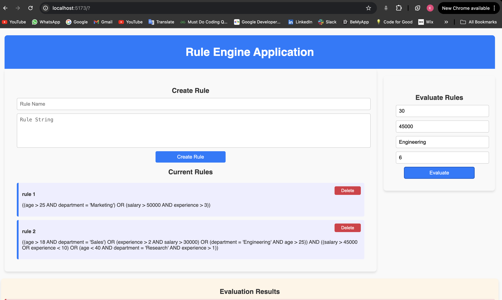
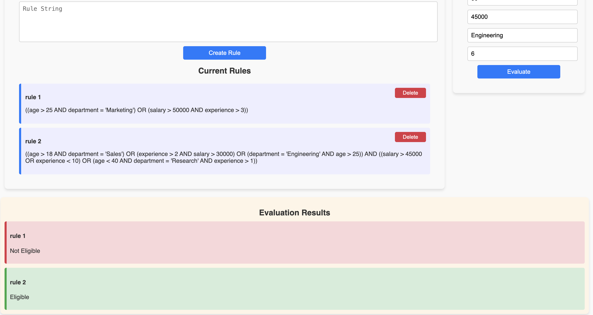
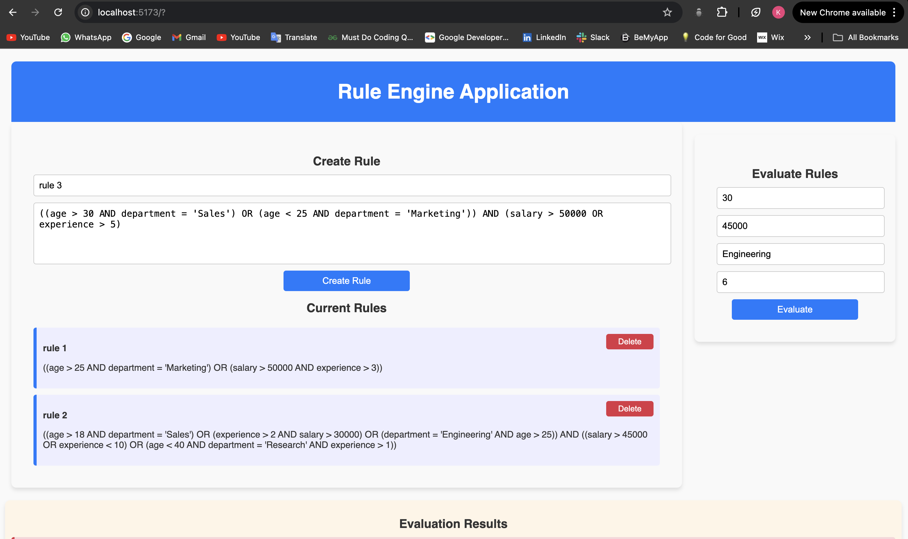
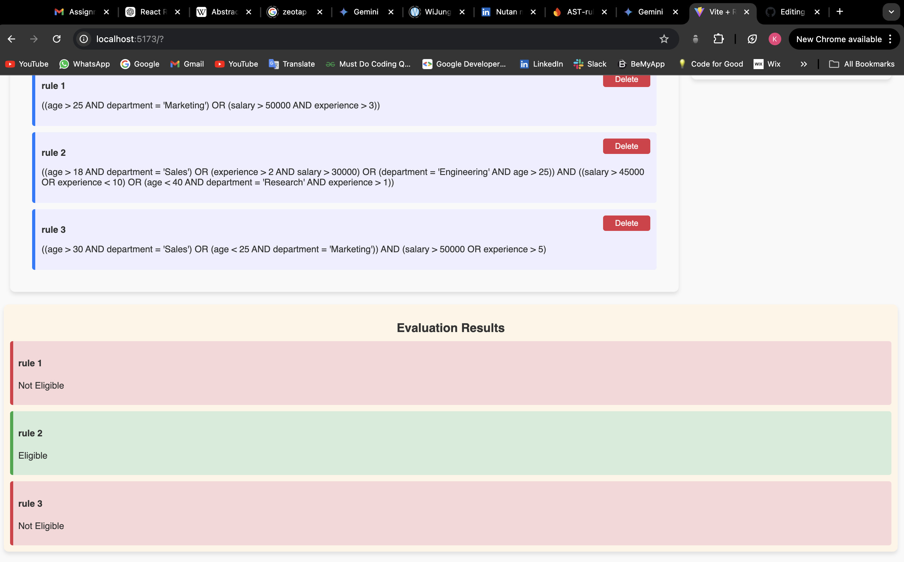

# Rule Engine with Abstract Syntax Tree (AST)

Welcome to the **Rule Engine with AST** project, an application designed to dynamically create, combine, and modify rules to determine user eligibility based on attributes such as age, department, income, and more. This 3-tier architecture application includes a simple UI, API/backend, and data storage to process rules with efficiency and scalability.

## 📋 Objective

Develop a 3-tier rule engine that:
- Uses Abstract Syntax Tree (AST) to represent and manipulate conditional rules.
- Enables dynamic rule creation, modification, and combination for complex conditions.
- Evaluates user eligibility based on specified attributes and rule criteria.

## 🛠️ Features

- **AST Representation:** Dynamically generated ASTs for conditional rules to streamline rule creation and combination.
- **Flexible Rule Creation:** Supports custom rules based on user-defined conditions.
- **Rule Combination:** Combines multiple rules into a single AST, optimizing checks and minimizing redundancies.
- **Eligibility Evaluation:** Checks user eligibility based on attributes like age, department, salary, and experience.
- **Error Handling & Validation:** Validates data inputs and rule strings to ensure reliability.
- **User Interface:** Simple UI for creating, combining, and testing rules, alongside eligibility evaluations.

## Technologies Used

**Rule Engine** utilizes a variety of technologies for both the frontend and backend. Here’s a breakdown:

### Frontend

- **[React](https://reactjs.org/)**: A JavaScript library for building user interfaces.
- **[styled-components](https://styled-components.com/)**: A library for writing CSS-in-JS, enabling the creation of styled React components.
- **[Axios](https://axios-http.com/)**: A promise-based HTTP client for making requests to the API.

### Backend

- **[Node.js](https://nodejs.org/)**: JavaScript runtime for executing server-side code.
- **[Express](https://expressjs.com/)**: A web application framework for Node.js to build APIs.
- **[Firebase](https://firebase.google.com/)**: A platform for developing mobile and web applications, providing a real-time NoSQL database for storing weather data.

## 🔧 Firebase Configuration

To set up Firebase for this application, follow these steps:

1. **Create a Firebase Project:**
   - Go to the [Firebase Console](https://console.firebase.google.com/).
   - Click on "Add Project" and follow the prompts to create a new project.

2. **Set Up Firestore:**
   - In your Firebase project, navigate to the Firestore Database section.
   - Click on "Create Database" and follow the setup instructions to create a Firestore database.

3. **Get Firebase Configuration:**
   - In your project settings, find the "Firebase SDK snippet" section and select "Config."
   - Copy the configuration details, which look something like this:
     ```javascript
     const firebaseConfig = {
       apiKey: "your_api_key",
       authDomain: "your_project_id.firebaseapp.com",
       projectId: "your_project_id",
       storageBucket: "your_project_id.appspot.com",
       messagingSenderId: "your_messaging_sender_id",
       appId: "your_app_id"
     };
     ```
   - This configuration is essential for connecting your application to Firebase.

## 💾 Data Structure

The AST-based rule structure represents each rule as a node-based structure with the following schema:

```javascript
{
  type: "operator" | "operand", // Specifies whether the node is an operator (AND/OR) or operand (condition)
  left: Node,                   // Left child for operators
  right: Node,                  // Right child for operators
  value: Any                    // Optional value for operands (e.g., number for comparisons)
}
```

### Sample Rules
Here are some example rules to illustrate the structure:

```plaintext
rule1 = "((age > 30 AND department = 'Sales') OR (age < 25 AND department = 'Marketing')) AND (salary > 50000 OR experience > 5)"
rule2 = "((age > 30 AND department = 'Marketing')) AND (salary > 20000 OR experience > 5)"
```

These rules are converted into corresponding ASTs, allowing efficient manipulation and evaluation.

## 🔑 Environment Variables
Set environment variables in a .env file in the backend directory:

```plaintext
FIREBASE_CONFIG='your_firebase_config'
PORT=5001
```

## 🖼️ Screenshots
Here are some screenshots of the Weather Monitoring System:







## 🚀 Getting Started

### Prerequisites
- **Node.js** - JavaScript runtime for backend services.
- **Firebase** - For database storage.
- **React** - For frontend user interface.

### Installation
#### Clone the Repository

```bash
git clone https://github.com/Kush-17/rule-engine-ast.git
cd rule-engine-ast
```

#### Backend Setup

```bash
cd backend
npm install
```

#### Frontend Setup

```bash
cd ../frontend
npm install
```

### Running the Application
#### Start Backend Server

```bash
cd backend
npm start
```

#### Start Frontend Server

```bash
cd ../frontend
npm run dev
```

Open the frontend on http://localhost:5173 and test the application.

## 🌐 API Endpoints

### Endpoints

- **`POST /api/rules`**
  - **Description**: Accepts a rule string, parses it, and stores the generated AST.
  - **Request Body**:
    ```json
    {
      "ruleName": "ruleName",
      "ruleString": "rule expression"
    }
    ```
  - **Response**:
    - **Success**: Returns the root node of the AST.
      ```json
      {
        "ruleName": "ruleName",
        "ast": "AST representation"
      }
      ```

- **`POST /api/rules/evaluate`**
  - **Description**: Evaluates a rule's AST against provided data attributes.
  - **Request Body**:
    ```json
    {
      "rule_id": "rule_id",
      "data": {
        "age": 35,
        "department": "Sales"
      }
    }
    ```
  - **Response**:
    - **Success**: Returns true if data meets rule conditions, false otherwise.
      ```json
      {
        "result": true
      }
      ```

- **`GET /api/rules`**
  - **Description**: Retrieves all stored rules.
  - **Response**:
    - **Success**: Returns an array of rules.
      ```json
      [
        {
          "id": "rule_id",
          "rule_string": "rule expression",
          "ast": "AST representation"
        },
      ]
      ```

- **`DELETE /api/rules/:id`**
  - **Description**: Deletes a specific rule by its ID.
  - **Response**:
    - **Success**: Returns a confirmation message.
      ```json
      {
        "message": "Rule deleted successfully"
      }
      ```

## 🧪 Testing
To verify the API endpoints and application functionality:
- **Test Rule Creation Endpoint**: Create individual rules and check AST responses in Postman or browser dev tools.
- **Test Rule Combination Endpoint**: Combine multiple rules and verify combined AST structure.
- **Evaluate Rule**: Input sample data against combined rules to test eligibility results.

## 📜 Acknowledgments
- Firebase for data management and storage.
- React and Node.js for providing scalable and flexible frameworks.
- Abstract Syntax Trees for enabling efficient rule evaluation.

Thank you for using the Rule Engine with AST! Feel free to reach out if you have any questions or feedback.
